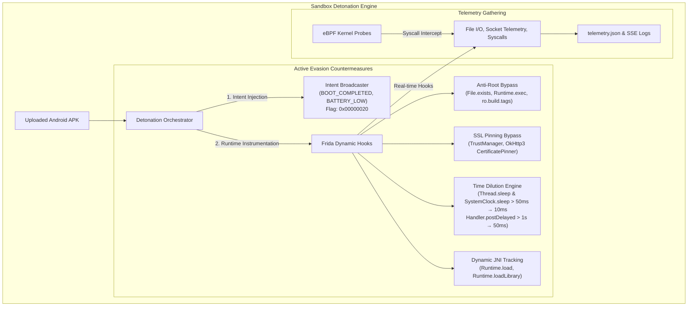

# Kavach.ai: Dynamic Analysis & Sandbox Detonation Walkthrough

This document provides a comprehensive technical walkthrough of the **Dynamic Analysis Pipeline (Stage 4)** within Kavach.ai. It covers the architecture, the technology stack, the active evasion bypassing mechanisms (time dilution, intent injection, JNI scanning, anti-root, and SSL pinning), how runtime telemetry is gathered, and how it is streamed and visualized in the React frontend.

---

## 1. Architectural Architecture & Data Flow

The Kavach.ai dynamic analysis phase operates as a reactive sandbox detonation system. When an APK is uploaded, it is routed to a physical or simulated Android environment where its runtime behaviors are monitored under active evasion mitigation hooks.

```mermaid
sequenceDiagram
    participant Frontend as React SPA (Vite)
    participant Backend as FastAPI Server
    participant Detonator as DetonationOrchestrator
    participant Frida as Frida Hooking Engine
    participant eBPF as eBPF Kernel Tracker
    participant Emulator as Android Device (ADB)

    Frontend->>Backend: POST /api/detonate-stream (Upload APK)
    Backend->>Backend: Save Temp APK & Resolve Package ID
    Backend->>Frontend: Send Metadata SSE Event (Name, Size, Package)
    
    rect rgb(20, 20, 25)
        Note over Backend, Emulator: Detonation Sequence Started
        Backend->>eBPF: start_trace(package_name)
        eBPF->>eBPF: Initialize Syscall / File / Socket Tracing
        Backend->>Detonator: detonate_apk()
        Detonator->>Emulator: adb install -r apk_path
        Detonator->>Emulator: Grant Permissions & Activate Device Admin
        Detonator->>Frida: frida -U -f package -l frida_bypass.js
        Frida->>Emulator: Inject Anti-Root, SSL Pinning & Time Dilution Hooks
        Detonator->>Emulator: Broadcast Intents (BOOT_COMPLETED, BATTERY_LOW [0x00000020])
        Detonator->>Emulator: Trigger UI Activities via monkey
        Frida-->>Detonator: Stream Hook Hits (File I/O, Sockets, JNI .so Loads, Time Dilution)
        Detonator->>Emulator: Observe telemetry for duration (10s)
    end

    eBPF->>Backend: Dump Telemetry Payload to telemetry.json
    Detonator->>Emulator: adb uninstall package
    Detonator->>Frida: Terminate Session
    
    Backend->>Frontend: Send Log SSE Events (Real-time Console Logs)
    Backend->>Frontend: Send Result SSE Event (telemetry.json Payload)
    Frontend->>Frontend: Update UI and render ReportView Dashboard
```



### 1.1. Active Evasion Bypassing Subsystem

Android malware frequently deploys multi-layered evasion techniques to defeat automated analysis. Kavach.ai neutralizes these evasions dynamically:



---

## 2. Technology Stack

The dynamic analysis pipeline integrates several specialized security and systems-level tools:

*   **FastAPI (Python 3)**: Serves as the high-throughput backend gateway. It processes incoming multipart/form-data APK uploads, spawns asynchronous tasks using `asyncio.to_thread`, redirects pipeline logger output thread-safely into an `asyncio.Queue` using a custom `AsyncQueueHandler`, and streams live log events to the frontend via **Server-Sent Events (SSE / EventSource)**.
*   **Android Debug Bridge (ADB)**: Acts as the command bridge to target devices/emulators. It installs the application, launches core activities, broadcasts hardware-level intents (`BOOT_COMPLETED`, `BATTERY_LOW`), auto-activates device admin policies, and uninstalls the app upon compilation.
*   **Frida**: A dynamic instrumentation toolkit. Used to inject JavaScript hooks into the Dalvik/ART runtime at app-startup to override security checks (Root, SSL Pinning) and accelerate artificial timing delays (Time Dilution).
*   **eBPF (Extended Berkeley Packet Filter)**: Operates at the Linux/Android kernel level. It hooks system calls (`sys_clone`, `sys_connect`, `sys_openat`, `sys_write`) to track file I/O and network sockets invisibly, bypassing user-space tampering.
*   **React & TypeScript (Vite)**: The user-facing dashboard. Uses SSE streams to show live logs in an interactive terminal, parses telemetry data, calculates risk indexes, and draws analytical graphs using **Recharts**.

---

## 3. Detailed Script Analysis (Dynamic Side)

The core dynamic pipeline scripts reside under [kavach_ai/backend/pipeline/stage4_dynamic](file:///c:/Users/Admin/Documents/Projects/Kavach/kavach_ai/backend/pipeline/stage4_dynamic).

### 3.1. Stage 4 Pipeline Orchestrator: `__init__.py`
*   **File Link**: [__init__.py](file:///c:/Users/Admin/Documents/Projects/Kavach/kavach_ai/backend/pipeline/stage4_dynamic/__init__.py)
*   **Primary Responsibility**: Coordinates the tracking and detonation modules.
*   **Core Logic**:
    1.  Resolves paths for local outputs (`telemetry.json`) and the Frida scripts.
    2.  Instantiates `DetonationOrchestrator` to detect device presence.
    3.  If live device is connected: runs `orchestrator.detonate_apk()` and compiles the dynamic telemetry payload containing:
        - `objection_root_bypass`: Boolean flag for root evasion triggers.
        - `objection_ssl_pinning_bypass`: Boolean flag for SSL pinning bypass triggers.
        - `time_dilution_bypass`: Boolean flag for intercepted `Thread.sleep`/`SystemClock.sleep` delays.
        - `ebpf_telemetry`: File accesses, network connections, and kernel syscalls.
        - `native_libraries`: Dynamically loaded `.so` libraries.
    4.  If no device is connected: activates `EBPFTracker` in simulation fallback mode to emit synthetic, high-fidelity threat telemetry matching the live schema.

### 3.2. Detonation Orchestrator: `detonate.py`
*   **File Link**: [detonate.py](file:///c:/Users/Admin/Documents/Projects/Kavach/kavach_ai/backend/pipeline/stage4_dynamic/detonate.py)
*   **Primary Responsibility**: Manages the Android sandbox lifecycle (ADB deployments, Frida instrumentation, permission/admin management, time dilution event parsing, and intent broadcasts).
*   **Core Operations**:
    *   `_check_device_connected`: Runs `adb devices` to identify if an active emulator/device is connected, ignoring `"offline"` or `"unauthorized"` states.
    *   `_get_device_abi`: Queries the device's CPU architecture via `adb shell getprop ro.product.cpu.abi` (falling back to `ro.product.cpu.abilist`).
    *   `_strip_native_libraries`: Extracts the APK and removes the `/lib` directory to prevent architecture-mismatch installation failures (`INSTALL_FAILED_NO_MATCHING_ABIS`).
    *   `install_apk`: Implements a 3-attempt retry loop that handles APK deployment, signing invalid packages (`jarsigner`) or stripping ABIs when needed.
    *   `_auto_activate_device_admin`: Programmatically activates registered `DEVICE_ADMIN_ENABLED` receivers using `adb shell dpm set-active-admin` without prompting the user.
    *   `trigger_intents`: Executes activity manager shell commands (`am broadcast`) with flag `0x00000020` (`FLAG_INCLUDE_STOPPED_PACKAGES`) to detonate dormant banking trojans and droppers that wait for `BOOT_COMPLETED` or `BATTERY_LOW` system events.
    *   `_read_frida_output`: Intercepts and parses real-time Frida log streams, detecting:
        - Anti-root evasion attempts.
        - SSL pinning overrides.
        - **Time dilution interventions** (`[Kavach-Sandbox] Time dilution:`).
        - File reads/writes to sensitive system and sandbox paths.
        - Network socket connections (`IP:Port`).
        - Native JNI library loads (`Runtime.load` / `Runtime.loadLibrary`).
    *   `detonate_apk`: Orchestrates the sequence synchronously:
        `Install` $\rightarrow$ `Grant Permissions` $\rightarrow$ `Auto-activate Device Admin` $\rightarrow$ `Spawn Frida Hooks` $\rightarrow$ `Trigger Intents (BOOT_COMPLETED / BATTERY_LOW)` $\rightarrow$ `Dismiss Overlays` $\rightarrow$ `Wait 10s (Observation)` $\rightarrow$ `Uninstall App`.

### 3.3. eBPF Tracker: `scripts/ebpf_trace.py`
*   **File Link**: [ebpf_trace.py](file:///c:/Users/Admin/Documents/Projects/Kavach/kavach_ai/backend/pipeline/stage4_dynamic/scripts/ebpf_trace.py)
*   **Primary Responsibility**: Tracks system calls, socket creation, and filesystem access.
*   **Core Operations**:
    *   `check_ebpf_support`: Inspects `/sys/kernel/debug/tracing`. On development systems without kernel debug headers, triggers high-fidelity fallback telemetry.
    *   `generate_mock_telemetry`: Constructs realistic trace data mirroring active malware behavior:
        *   **Bypasses**: `objection_root_bypass: true`, `objection_ssl_pinning_bypass: true`, `time_dilution_bypass: true`.
        *   **Syscalls**: `sys_clone`, `sys_execve`, `sys_socket`, `sys_connect`, `sys_write`, `sys_openat`.
        *   **Files Accessed**: `/data/user/0/<package>/shared_prefs/config.xml`, `/proc/self/maps`, `/system/bin/app_process32`.
        *   **Network Connections**: Direct C2 connections (`198.51.100.42:4444` TCP) and DNS queries (`8.8.8.8:53` UDP).
    *   `start_trace`: Writes the gathered telemetry to `telemetry.json`.

### 3.4. Frida Hook Script: `scripts/frida_bypass.js`
*   **File Link**: [frida_bypass.js](file:///c:/Users/Admin/Documents/Projects/Kavach/kavach_ai/backend/pipeline/stage4_dynamic/scripts/frida_bypass.js)
*   **Primary Responsibility**: Deactivates anti-sandboxing controls (Root, SSL Pinning, Sleep Evasion) and logs runtime telemetry.
*   **Stability & Thread Safety Enhancements**:
    *   **Thread-Local Re-entrancy Guards**: Employs a Java `ThreadLocal` object (boxed `java.lang.Boolean`) to prevent infinite recursion/deadlocks inside filesystem hook wrappers (`FileInputStream`/`FileOutputStream`).
    *   **Safe Exception Properties**: Avoids crash conditions when intercepting target app exceptions by safely verifying class presence using `typeof e.$className.includes === 'function'`.
    *   **Socket Type Verification**: Bypasses local/IPC cast errors in `Socket.connect` by verifying address arguments using `InetSocketAddress.class.isInstance(endpoint)`.
*   **Hooks Implemented**:
    1.  **Anti-Root Detection Bypass**:
        *   `java.io.File.exists`: Intercepts paths matching root binaries (`su`, `busybox`, `SuperSU`, `Superuser.apk`) and forces a `false` return.
        *   `java.lang.Runtime.exec`: Blocks commands executing `su` or `busybox` and throws a fake `IOException`.
        *   `android.os.SystemProperties.get`: Rewrites `ro.build.tags` from `test-keys` to `release-keys`.
    2.  **SSL Pinning Bypass**:
        *   `javax.net.ssl.SSLContext.init`: Registers a custom `X509TrustManager` that trusts all certificates, enabling upstream proxy decryption.
        *   `okhttp3.CertificatePinner.check`: Nullifies OkHttp3 certificate pinning checks.
    3.  **Time Dilution & Sleep Evasion Bypass**:
        *   `java.lang.Thread.sleep(long)` & `(long, int)`: Intercepts delays $> 50\text{ms}$ and accelerates them to $10\text{ms}$ to prevent malware from sleeping past sandbox timeouts.
        *   `android.os.SystemClock.sleep(long)`: Intercepts delays $> 50\text{ms}$ and accelerates them to $10\text{ms}$.
        *   `android.os.Handler.postDelayed(Runnable, long)`: Accelerates delayed message queues $> 1000\text{ms}$ down to $50\text{ms}$.
    4.  **Telemetry Collection**:
        *   `FileInputStream` / `FileOutputStream`: Captures all file reads and writes.
        *   `Socket.connect`: Logs outbound network IP/port destinations.
        *   `Runtime.load` / `Runtime.loadLibrary`: Scans and logs dynamically loaded native JNI shared libraries (`.so`).

---

## 4. Frontend-Backend Communication Flow (SSE)

Real-time terminal execution logging is achieved using Server-Sent Events (SSE).

### Backend Streaming Endpoint: `main.py`
*   **File Link**: [main.py](file:///c:/Users/Admin/Documents/Projects/Kavach/kavach_ai/backend/app/main.py)
*   **Endpoint**: `POST /api/detonate-stream?simulation={true/false}`
*   **Logic**:
    1.  Saves the incoming file streams to a temporary `.apk` file.
    2.  Resolves the APK's package identifier using `pyaxmlparser`/`androguard`.
    3.  Yields a `metadata` event:
        ```json
        { "type": "metadata", "apk_details": { "name": "...", "size": "...", "package": "..." } }
        ```
    4.  **Log Interception**: Attaches an `AsyncQueueHandler` to system loggers (`KavachDetonator`, `KavachPipelineStage4`, `KavacheBPF`).
    5.  **Streaming Loop**: Yields log lines as SSE events in real-time:
        ```text
        data: {"type": "log", "message": "Installing APK..."}
        ```
    6.  **Results Yield**: Once detonation finishes, it retrieves the final parsed telemetry dictionary and sends the `result` event:
        ```json
        { "type": "result", "telemetry": { ... } }
        ```

### Frontend Event Source Reader: `DetonationContext.tsx`
*   **File Link**: [DetonationContext.tsx](file:///c:/Users/Admin/Documents/Projects/Kavach/kavach_ai/frontend/src/context/DetonationContext.tsx)
*   **Mechanism**:
    *   Reads the streaming body directly using `response.body.getReader()`.
    *   Decodes chunks using `TextDecoder` and splits by the event boundary `\n\n`.
    *   State Transitions:
        *   `type: 'log'` $\rightarrow$ Appends to `logs` state (rendered dynamically in `TerminalConsole`).
        *   `type: 'metadata'` $\rightarrow$ Sets `apkDetails` state.
        *   `type: 'result'` $\rightarrow$ Saves the telemetry payload to `telemetry` and changes state to `completed`.
        *   `type: 'error'` $\rightarrow$ Sets state to `error`.

---

## 5. Frontend Telemetry Analysis & Consumption

Once the backend streams the `result` payload, the [report-view.tsx](file:///c:/Users/Admin/Documents/Projects/Kavach/kavach_ai/frontend/src/components/report-view.tsx) dashboard parses the telemetry to generate intelligence widgets.

### 5.1. Threat Score Calculation
The frontend computes a dynamic risk score (`probability`) at runtime based on the telemetry parameters:
*   **Base Score**: Starts at `0.05` (5%).
*   **Frida Hook Triggers**: Adds `0.35` if Root bypass hooks were triggered (`objection_root_bypass`), `0.30` if SSL bypasses occurred (`objection_ssl_pinning_bypass`), and `0.25` if time dilution bypasses occurred (`time_dilution_bypass`).
*   **File I/O Signals**: System path reads (e.g., `app_process`, `/system`) increase the threat score by `0.25` each. Internal config/preference directory reads add `0.15` each.
*   **Network Vectors**: Socket connections on reverse-shell ports (such as `4444`) increase the score by `0.45`. Other standard connection requests add `0.10`.
*   **Verdict Classification**:
    *   `score > 0.65` $\rightarrow$ **MALICIOUS** (Red highlighting)
    *   `0.30 < score <= 0.65` $\rightarrow$ **SUSPICIOUS** (Amber highlighting)
    *   `score <= 0.30` $\rightarrow$ **CLEAN** (Emerald highlighting)

### 5.2. Visual Charts (Recharts)
*   **Forensic Attributions**: Bar chart mapping security categories derived from telemetry array counts (socket counts, syscall frequencies).
*   **Instrumentation Streams**: Area chart showing step-by-step socket connections (TCP/UDP) over the observation window.
*   **SHAP Feature Attribution**: Horizontal bar chart comparing positive (malicious) and negative (benign) features. Frida bypasses (Root, SSL, Time Dilution), reverse-shell sockets, and core file operations are plotted with red bars, while standard calls are plotted with blue bars.
*   **Behavioral Risk Matrix**: Radar chart mapping normalized risk vectors: Data Theft, Financial Fraud, Persistence, Privilege Escalation, Evasion, and Command & Control (C2).

### 5.3. Pipeline Tab Items & MITRE ATT&CK Mapping
The dynamic telemetry maps directly to MITRE ATT&CK techniques:

| Telemetry Signal | MITRE Technique | Description |
| :--- | :---: | :--- |
| `objection_ssl_pinning_bypass` | **T1112 / T1557** | Modify System Preferences / Adversary-in-the-Middle |
| `objection_root_bypass` | **T1055 / T1068** | Process Injection / Exploitation for Privilege Escalation |
| `time_dilution_bypass` | **T1497 / T1497.003** | Virtualization/Sandbox Evasion: Time Based Evasion |
| `trigger_intents (BOOT_COMPLETED)` | **T1624 / T1547.001** | Event-Triggered Execution: Broadcast Receivers |
| `port: 4444 (Reverse Shell)` | **T1020 / T1095** | Automated Exfiltration / Non-Application Layer Protocol |
| `native_libraries (.so load)` | **T1629 / T1129** | Shared Modules / Execution through Native Code |

### 5.4. CERT-In Readiness Compliance Mapping
*   **CERT-In Sec 12.2 (Anti-Tampering & Anti-Rooting)**: Flags violation if application executes root-probing checks or evades sandbox hooks.
*   **CERT-In Sec 14.5 (Network & Transport Security)**: Flags violation if application relies on bypassed SSL TrustManagers or unencrypted C2 sockets.
*   **CERT-In Sec 8.1 (Local Storage Security)**: Flags violation if credentials or tokens are written in cleartext to `/data/user/0/<package>/shared_prefs`.
