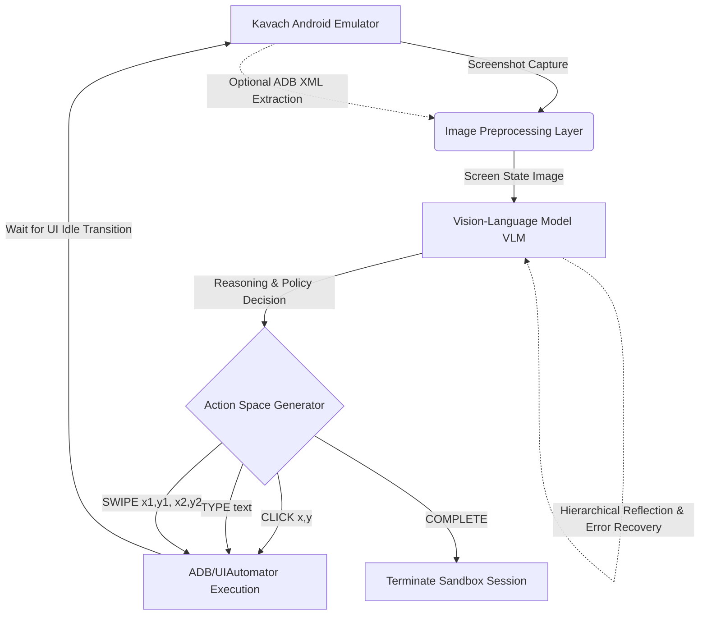
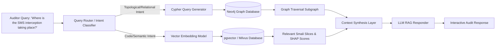
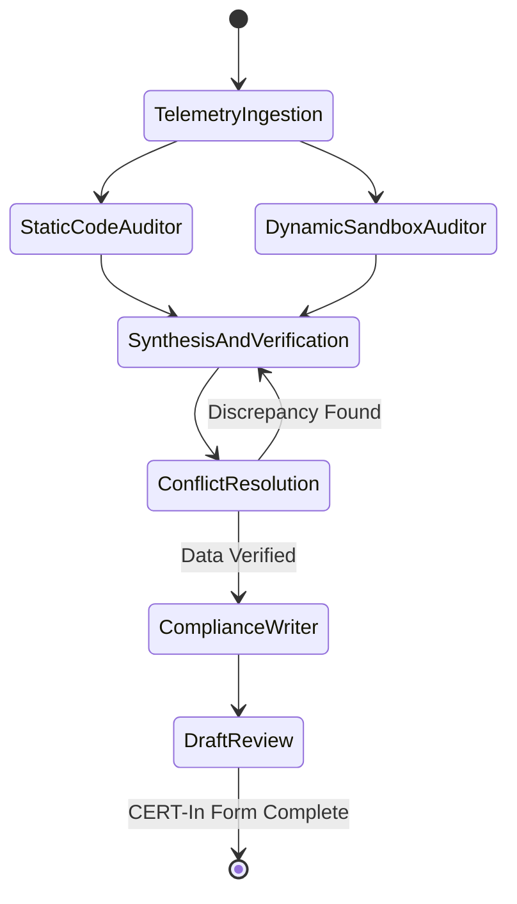

# Next-Generation Generative AI Integration for Automated Mobile Threat Intelligence Systems

The landscape of mobile threat intelligence requires continuous, aggressive evolution to counter the rapid advancement of malware obfuscation, dynamic payload delivery, and execution-environment evasion mechanisms. Traditional static and dynamic analysis pipelines, while foundational, often fail to capture the nuanced semantics of heavily obfuscated Android Application Packages (APKs) or bypass sophisticated anti-analysis techniques that detect automated sandbox environments. 

The Kavach automated mobile threat intelligence system currently employs a robust pipeline, utilizing backward program slicing, SecureBERT-2.0 tokenization, Frida-based dynamic instrumentation, and eBPF kernel event probes. However, transitioning from deterministic heuristic analysis to semantic, intent-driven intelligence requires the integration of advanced Generative AI architectures.

This report details the implementation of Large Language Models (LLMs), specialized Code-LLMs, and Multimodal Vision-Language Models (VLMs) to enhance the Kavach architecture across four critical domains:
1. **Bidirectional Code Decompilation & Explainability**
2. **Autonomous User-Interface Sandboxing (VLM Monkey Agent)**
3. **Heterogeneous Graph-based Retrieval-Augmented Generation (GraphRAG)**
4. **Multi-Agent Compliance Synthesis for CERT-In Reporting**

---

## 1. Advanced Smali Bytecode Explainability and Decompilation

Reverse engineering portable executable files and Dalvik bytecode remains a critical bottleneck in cybersecurity analysis due to the pervasive use of sophisticated obfuscation techniques, control-flow flattening, and dynamic component registration [1]. While the existing Kavach pipeline successfully identifies dangerous API sinks through backward program slicing and classifies malicious probabilities using SecureBERT-2.0, human auditors struggle to interpret the raw Smali output. To bridge the semantic gap between machine-level execution and human-readable analysis, the integration of Code-LLMs facilitates advanced Smali bytecode explainability and pseudo-code reconstruction.

### 1.1. Domain-Adaptive Fine-Tuning and Model Selection

General-purpose LLMs are predominantly pretrained on benign, open-source high-level languages (e.g., Python, Java, C++), leaving them ill-equipped to handle the statistical distributions and semantic anomalies inherent to malicious Android bytecode [3]. Effective reverse engineering requires domain-specific representation learning explicitly tailored to both benign and malicious execution patterns. Frameworks such as **LLM4CodeRE** demonstrate that bidirectional code reverse engineering—supporting both assembly-to-source decompilation and source-to-assembly translation—can be achieved within a unified model architecture by treating low-level code translation as a causal language modeling task [2].

To optimize Code-LLMs for Smali interpretation without catastrophic forgetting of foundational programming logic, parameter-efficient fine-tuning (PEFT) mechanisms are mandatory [3]. A hybrid adaptation strategy combining Low-Rank Adaptation (LoRA) updates with task-specific Multi-Adapters enables the model to align with the syntactical constraints of Dalvik bytecode while preserving generalized reasoning capabilities [2]. Furthermore, employing a Sequence-to-Sequence (Seq2Seq) unified prefixing approach enforces end-to-end generation constraints, ensuring that the reconstructed Java or Python pseudocode maintains structural fidelity and executable correctness relative to the original Smali [2].

The selection of the underlying Code-LLM heavily dictates the accuracy of the decompiled pseudocode and the detection of cryptographic or evasion routines:

| Model Designation | Parameter Size | Context Length | Architecture / Tuning Focus | Recommended Quantization |
| :--- | :--- | :--- | :--- | :--- |
| **Qwen2.5-Coder-Instruct** | 32B | 32k – 128k | Causal LM, strong code reasoning, multi-language | AWQ 4-bit / GPTQ |
| **DeepSeek-Coder-V2** | 16B – 236B | 128k | Mixture-of-Experts (MoE), advanced math/code | FP8 / GGUF 4-bit |
| **Llama-3.1-Instruct** | 70B | 128k | Generalist, robust logic deduction | AWQ 4-bit |
| **Qwen2.5-Coder-Instruct** | 7B | 32k | Efficient inference, suitable for rapid triage | bfloat16 / 8-bit |

The **Qwen2.5-Coder-32B-Instruct** model provides an optimal balance of context capacity and reasoning capability, achieving exceptional fault localization and defect prediction when applied to static code features and Smali files [3]. For deployment in a high-throughput pipeline where GPU VRAM is constrained, models quantized to 4-bit using Activation-aware Weight Quantization (AWQ) or Generalized Post-Training Quantization (GPTQ) maintain semantic accuracy while significantly reducing hardware overhead.

### 1.2. Context Window Management for Bytecode Slices

Smali files extracted from enterprise-scale APKs frequently exceed the context window limitations of standard LLMs, even those supporting 128k tokens. Feeding entire decompiled directories into an inference pipeline is computationally prohibitive, dilutes the attention mechanism's focus on malicious routines, and increases hallucination rates. Kavach's existing backward program slicing methodology provides the foundational solution by isolating execution paths targeting dangerous API sinks.

However, handling code token sizes requires a sophisticated context management strategy:
* The architecture implements a **sliding-window chunking mechanism** over the Control Flow Graph (CFG).
* When a backward slice from a sink (e.g., `Landroid/telephony/SmsManager;->sendTextMessage`) generates a Smali sequence exceeding the model's token limit, the sequence is segmented based on Abstract Syntax Tree (AST) boundaries—specifically method boundaries and class instantiations.
* These bytecode slices are tokenized and processed hierarchically. The Code-LLM processes individual functional blocks to generate intermediate semantic summaries.
* A **Map-Reduce prompting structure** is then applied: the *"Map"* phase translates isolated Smali methods into high-level pseudocode, and the *"Reduce"* phase synthesizes these localized translations into a comprehensive explanation of the macro-level evasion or cryptographic routine. This ensures that variables passed across deep method invocations are tracked accurately without overflowing the context window.

### 1.3. Implementation Prompt Structures

To direct the Code-LLM in reconstructing obfuscated routines, the system instructions enforce strict output formatting, context boundaries, and analytical priorities:

```markdown
[System Instruction]
You are a senior Android Reverse Engineering and Cryptography Specialist. Your objective is to decompile, de-obfuscate, and explain isolated Smali bytecode slices extracted via backward program slicing.

Constraint 1: Translate the provided Smali control-flow sequence into high-level Python or Java pseudocode.
Constraint 2: Identify any anti-analysis evasion tactics, reflection mechanisms, or dynamic component registrations (e.g., DexClassLoader, encrypted strings).
Constraint 3: If cryptographic APIs are detected (e.g., javax/crypto/Cipher), explain the key derivation function, block cipher mode, and initialization vector (IV) structures.

Output Format: Use valid Markdown. Provide the reconstructed pseudocode in a fenced code block, followed by a detailed semantic explanation of the execution flow and data provenance.

[User Input]
Target API Sink: {api_sink_signature}
Backward Slice Depth: {slice_depth}
Identified SHAP High-Attribution Tokens: {shap_tokens}
Smali Bytecode Slice:
{smali_token_sequence}
```

By leveraging the synergy between the deterministic constraints of the backward slice and the generative capabilities of the Code-LLM, the Kavach pipeline bypasses the engineering bottleneck of manual inspection. This streamlines the validation of vulnerabilities and the identification of complex inter-component communication (ICC) attack vectors [1].

---

## 2. Generative UI Interactive Sandboxing (Autonomous Monkey Agent)

Stage 2/4 of the Kavach pipeline currently relies on traditional sandbox detonation inside an Android emulator using Frida for root-check bypasses and SSL pinning defeat. However, static execution triggers are increasingly insufficient. Modern Android malware frequently utilizes dynamic class loading, encrypted payloads, and dormant behaviors that only activate under highly specific user interactions [1]. Traditional dynamic analysis relies on automated "monkey testers" that generate pseudo-random coordinate taps and swipes [8]. Sophisticated malware trivially detects these random interaction patterns, or it hides malicious payloads behind complex authentication flows—such as solving CAPTCHAs, entering specific login credentials, or interacting with multi-step verification screens—that random testers cannot logically navigate.

Integrating **Multimodal Vision-Language Models (VLMs)** transforms the dynamic execution sandbox into an autonomous, intent-driven agent capable of mimicking genuine human interaction, thereby bypassing evasion techniques and triggering dormant code.

### 2.1. Multimodal Agent Architecture and Coordinate Grounding

The transition from text-based heuristics to VLMs enables the sandbox agent to visually perceive the emulator screen, process the Graphical User Interface (GUI) layout, and intelligently deduce the necessary actions to navigate the application. VLM agents operate through a continuous observation-thought-action feedback loop, dependent on the Android Debug Bridge (ADB) or UIAutomator2 for executing commands and capturing screen states [9].



To interact with the GUI, the VLM must ground its visual understanding into precise coordinate outputs across three primary operation modes:
1. **XML Mode**: Extracts the UI accessibility tree (view hierarchy) via ADB, compressing layout data into a text-based representation. However, ADB frequently fails to acquire XML for dynamic components, games, WebViews, or heavily obfuscated malicious overlays that intentionally corrupt the accessibility tree to evade analysis [10].
2. **Set-of-Mark (SoM) Mode**: Overlays numeric bounding boxes on all clickable or focusable elements directly on the captured screenshot. The VLM processes this annotated image and outputs the specific ID of the target element, which the orchestrator maps back to screen coordinates [10].
3. **Native Coordinate Grounding**: Recent foundation models (e.g., Qwen2.5-VL, UI-TARS) output normalized bounding box coordinates (e.g., `[0.25, 0.45, 0.30, 0.50]`) without intermediate SoM overlays or XML extraction, significantly reducing preprocessing latency and remaining entirely agnostic to underlying OS-level obfuscation [11].

### 2.2. Hierarchical Reflection and VLM Model Selection

Autonomous GUI agents face significant challenges in long-horizon task execution, particularly concerning error recovery when an application fails to load, displays unexpected permission pop-ups, or enters stalled states [17]. To address this, the agent architecture implements a **hierarchical reflection mechanism**:
* **Step-Level Monitoring**: Verifies if a tap successfully transitioned the UI state.
* **Task-Level Evaluation**: Ensures the overall objective (e.g., reaching the final checkout screen to observe network exfiltration) is progressing [17]. If a fake login attempt fails, the reflection mechanism prompts the model to generate alternative credentials or seek a registration bypass.

| Multimodal VLM | Parameter Size | Coordinate Grounding Capability | Autonomous GUI Benchmark Performance |
| :--- | :--- | :--- | :--- |
| **Qwen2.5-VL-Instruct** | 72B | Exceptional direct coordinate output | SOTA on AndroidWorld (~62.9% – 70.1%) [15] |
| **UI-TARS-DPO** | 72B | Highly tuned for GUI via RL/DPO | Superior multi-turn stability (~74.2% – 78.6%) [15] |
| **GUI-Owl** | 32B | Native end-to-end GUI automation | Excellent cross-platform interaction (~82.9%) [15] |
| **Qwen2.5-VL-Instruct** | 32B | Strong SoM and XML understanding | Balanced performance/latency (~44.4%) [19] |
| **Qwen2.5-VL-Instruct** | 7B | Weak complex reasoning without RL | Poor instruction following (~21.6%) [17] |

Extensive benchmark evaluations indicate that 7B parameter models lack the proactive exploration and instruction-following abilities required for deep sandbox auditing unless heavily reinforced [19]. Models at the 32B and 72B scale, such as **Qwen2.5-VL-72B** and **UI-TARS-72B**, demonstrate the robust reasoning, precise visual grounding, and multi-turn stability necessary to realize complex mobile operation tasks [15]. UI-TARS, utilizing Group Relative Policy Optimization (GRPO) for reinforcement fine-tuning, is particularly suited for maintaining high performance as interaction rounds increase [20].

### 2.3. Autonomous Agent System Prompting

The VLM agent requires a structured prompt format defining the action space, interaction history across multiple emulator screenshots, and the adversarial objective [24]:

```markdown
[System Instruction]
You are an autonomous Malware Sandboxing Agent. Your objective is to actively explore the provided Android application, bypass benign authentication screens (generating plausible fake credentials if necessary), and trigger hidden malicious behaviors.

You are provided with the current screenshot of the Android emulator.

Action Space:
- CLICK(x, y): Taps the screen at the normalized coordinates [x, y].
- TYPE(text): Inputs the specified text into the currently focused field.
- SWIPE(x1, y1, x2, y2): Swipes from starting coordinates to ending coordinates.
- PRESS_BACK(): Simulates the Android back button to escape dead-ends.
- COMPLETE(): Concludes exploration if no further actionable screens remain.

Interaction History:
{interaction_history_json}

Current Task: Navigate deep into the application's configuration menus, accept all permission requests, and execute simulated financial transactions or account creation to trigger telemetry.

Output strictly one action from the Action Space based on the visual observation. Verify if the previous action succeeded before proceeding.
```

By deploying this VLM-driven agent, the Kavach system reliably bypasses static anti-analysis checks, navigates localized language prompts, and forces the malware to expose its dynamic footprint, which is subsequently captured by Frida and eBPF kernel-level probes.

---

## 3. Interactive RAG Chat for Malware Auditors

The culmination of static decompilation and dynamic VLM sandboxing produces a massive, heterogeneous telemetry dataset for a single APK. This dataset includes extracted `AndroidManifest` permissions, isolated Smali code slices, deep kernel event logs (eBPF traces), network packet captures, Frida hook outputs, and SHAP (SHapley Additive exPlanations) attribution scores used for localized bytecode classification. To empower security auditors to interrogate this data intuitively, the system requires an advanced **Retrieval-Augmented Generation (RAG)** architecture capable of handling multi-modal, highly interconnected data structures.

### 3.1. eBPF System Call Abstraction and Compression

During the dynamic VLM sandbox session, extended Berkeley Packet Filter (eBPF) programs—such as Tetragon, Tracee, or custom kprobes—monitor kernel-level events [7]. eBPF provides unparalleled visibility into dynamic instrumentation, capturing critical system calls (`execve`, `ptrace`, `openat`), memory operations (`memfd_create`), and network socket connections with near-zero latency overhead [7]. However, the sheer volume of eBPF telemetry generated during a standard sandbox session (often millions of events) makes it impossible to inject directly into an LLM's context window.

To resolve this, the pipeline applies a hybrid anomaly detection and compression mechanism prior to storage:
* **SyscallAD Framework**: Utilizes Variational Autoencoders (VAEs) and Isolation Forests to filter out benign, high-frequency system calls, isolating only anomalous behavioral sequences [28].
* **Context Aggregation**: Filtered sequences are grouped by Process ID (PID) and time-window, translating raw hexadecimal memory addresses and abstract socket descriptors into human-readable semantic summaries:
  > *Example*: `Process [PID 4501] initiated an unauthorized TLS connection to [198.51.100.23] and subsequently executed a fileless payload via memfd_create.`
* This compressed abstraction retains the forensic value necessary for the LLM while adhering to token constraints.

### 3.2. Hybrid Vector-Graph Storage (GraphRAG)

Standard vector databases (e.g., Milvus, pgvector) excel at semantic similarity searches, making them ideal for retrieving specific Smali code chunks or threat intelligence summaries based on natural language queries. However, vector similarity fundamentally fails to represent topological relationships, such as Android Inter-Component Communication (ICC), intent filters, temporal execution sequences, and process execution trees [29].

To address this, a hybrid **GraphRAG** architecture is implemented, utilizing a knowledge graph (e.g., Neo4j) to map the structural telemetry alongside a vector store for semantic embeddings [29]:
* **Graph Schema Nodes**: `Application`, `Activity`, `Service`, `Intent`, `Syscall`, `IP_Address`.
* **Directed Semantic Edges**: `TRIGGERS`, `EXFILTRATES_TO`, `BINDS_TO`, `REQUESTS_PERMISSION`.
* **SHAP Metadata**: Attribution matrices are serialized into JSON and stored as metadata properties on the corresponding `Smali_Method` nodes, allowing the LLM to understand exactly which tokens influenced the SecureBERT malicious classification.



### 3.3. Chunking Strategies and Query Routing

Effective chunking is critical for heterogeneous RAG:
* **Smali Code**: Structural chunking is applied based on Abstract Syntax Tree (AST) or functional block boundaries, ensuring each chunk represents a complete, compilable logical unit rather than arbitrary character splits.
* **eBPF Logs**: Temporal chunking groups events that occur within identical time frames or belong to the same execution thread.

When an auditor asks, *"Where in the Smali code is the SMS interception taking place, and what IP address does it exfiltrate to?"*, the Query Router dynamically classifies the intent:
1. Dispatches a semantic search to the vector database to locate the Smali slice matching *"SMS interception"* (leveraging SecureBERT tokenization).
2. Simultaneously prompts the LLM to generate a Cypher query traversing the Neo4j knowledge graph:

```cypher
// Example Generated Cypher Query for ICC and Exfiltration Tracking
MATCH (app:Application)-[:DECLARES]->(svc:Service)-[:RECEIVES]->(intent:Intent {action: "android.provider.Telephony.SMS_RECEIVED"})
MATCH (svc)-[:EXECUTES]->(smali:Smali_Method)-[:TRIGGERS]->(sys:Syscall {type: "connect"})
MATCH (sys)-[:EXFILTRATES_TO]->(ip:IP_Address)
RETURN smali.code_snippet, ip.address, sys.timestamp
```

The retrieval mechanism merges the results from both vector space and graph traversal [29]. The fused context presents the Code-LLM with a holistic view of both static code logic and dynamic runtime consequences, empowering the interactive chat agent to provide pinpoint-accurate, causally linked answers to complex reverse engineering queries.

---

## 4. Multi-Agent Synthesis Collaboration for Automated Compliance

Following the comprehensive static and dynamic audit of an APK, the final operational requirement of the Kavach system is the synthesis of these findings into formal incident response documentation. Regulatory frameworks, such as the Indian Computer Emergency Response Team (CERT-In) guidelines, enforce stringent compliance mandates:
* **Mandatory 6-Hour Reporting Window**: Mandatory notification for severe cybersecurity incidents (e.g., unauthorized access, data breaches, attacks on critical systems) [35].
* **180-Day Log Retention**: Mandatory maintenance of ICT system logs for a rolling period of 180 days to facilitate forensic attribution [35].

The CERT-In incident reporting format (**Annexure A**) requires precise categorization of the threat, technical footprints (IP addresses, hostnames), indicators of compromise (IOCs), symptoms observed, and actions taken to mitigate the attack [35]. Generating this report manually via a single monolithic LLM prompt based on raw, unfiltered telemetry frequently results in hallucinations, omission of critical network indicators, or misalignment with the specific regulatory taxonomy.

### 4.1. Multi-Agent Orchestration Architecture (LangGraph)

To overcome the limitations of a single-prompt approach, a multi-agent orchestration framework utilizing **LangGraph** is implemented to handle synthesis, cross-verification, and formatting of the final compliance report [38]. LangGraph manages the state of the incident response workflow as a cyclical graph, dividing the cognitive load among specialized AI agents with distinct roles, memory states, and validation constraints [38]:



The architecture consists of four specialized agents:
1. **Static Code Auditor Agent**: Queries GraphRAG to extract all static indicators. Reviews `AndroidManifest` for abused permissions, analyzes LLM-reconstructed pseudocode for malicious logic (e.g., credential harvesting algorithms), identifies SHAP attribution scores, and maps static behaviors to the MITRE ATT&CK Mobile matrix [28].
2. **Dynamic Sandbox Auditor Agent**: Operating strictly on empirical data captured during the VLM's autonomous sandbox session, this agent identifies runtime deviations. Parses compressed eBPF logs and Frida hooks to identify unauthorized lateral movement, fileless executions, and external IP communications [26].
3. **Synthesis and Verification Agent**: Acts as the cross-validation logic engine to identify false positives. Compares static claims against dynamic observations. For example, if the Static Agent claims an SMS exfiltration routine exists in code (based on high probability from SecureBERT), but the Dynamic Agent found no network activity during the VLM sandbox session, the Synthesis Agent flags the behavior as a *"dormant capability"* rather than an active breach, significantly reducing false-positive severity classifications and preventing unnecessary regulatory escalation.
4. **Compliance Writer Agent**: The finalized, verified threat model is passed to the Compliance Writer. Constrained strictly by a system prompt containing the exact structural schema of the CERT-In Annexure A reporting form [35]. Possesses no analytical autonomy; its sole function is formatting and linguistic alignment.

### 4.2. Automated CERT-In Data Mapping

The Compliance Writer Agent maps synthesized, conflict-resolved data directly into the mandatory fields of the CERT-In template, ensuring terminology aligns with regulatory expectations and the 6-hour reporting window is easily met [35]:

| CERT-In Annexure A Field | Telemetry Source & Validation Logic | Agent Responsible for Final Mapping |
| :--- | :--- | :--- |
| **Type of Incident** | MITRE ATT&CK categorization of combined static/dynamic payload behaviors. | Synthesis Agent |
| **Affected System IP/Host** | VLM Sandbox Environment Network Configuration. | Dynamic Auditor Agent |
| **Suspected Source IP** | eBPF socket tracing (`connect` syscalls) cross-referenced with GraphRAG topology. | Dynamic Auditor Agent |
| **Unusual Behavior / Symptoms** | eBPF process anomalies, file writes, and UI state changes captured by the VLM. | Dynamic Auditor Agent |
| **Actions Taken to Mitigate** | Orchestrator pipeline isolation rules and IOC generation. | Compliance Writer Agent |

The deployment of this LangGraph multi-agent framework guarantees that incident reporting is a rigorously verified compilation of forensic evidence rather than a probabilistic text generation exercise [38]. By aligning the detection capabilities of Code-LLMs and the interaction capabilities of the VLM sandbox directly with the strict formatting constraints of the Compliance Writer, the threat intelligence system achieves end-to-end automation. This operational readiness ensures organizational response remains well within the mandated 6-hour regulatory window, transforming a reactive compliance burden into a streamlined, highly accurate intelligence output [35].

---

## 5. Works Cited & References

1. **Static Detection of Filesystem Vulnerabilities in Android Systems** – arXiv:2407.11279 [https://arxiv.org/html/2407.11279v1](https://arxiv.org/html/2407.11279v1)
2. **LLM4CodeRE: Generative AI for Code Decompilation Analysis and Reverse Engineering** – ResearchGate [https://www.researchgate.net/publication/403605795_LLM4CodeRE_Generative_AI_for_Code_Decompilation_Analysis_and_Reverse_Engineering](https://www.researchgate.net/publication/403605795_LLM4CodeRE_Generative_AI_for_Code_Decompilation_Analysis_and_Reverse_Engineering)
3. **LLM4CodeRE: GenAI for Reverse Engineering** – arXiv:2604.06095 [https://arxiv.org/html/2604.06095v1](https://arxiv.org/html/2604.06095v1)
4. **SLDeep: Statement-Level Software Defect Prediction Using Deep-Learning Model on Static Code Features** – ResearchGate [https://www.researchgate.net/publication/338135562_SLDeep_Statement-Level_Software_Defect_Prediction_Using_Deep-Learning_Model_on_Static_Code_Features](https://www.researchgate.net/publication/338135562_SLDeep_Statement-Level_Software_Defect_Prediction_Using_Deep-Learning_Model_on_Static_Code_Features)
5. **Android Source Code Vulnerability Detection: A Systematic Literature Review** – ResearchGate [https://www.researchgate.net/publication/362779062_Android_Source_Code_Vulnerability_Detection_A_Systematic_Literature_Review](https://www.researchgate.net/publication/362779062_Android_Source_Code_Vulnerability_Detection_A_Systematic_Literature_Review)
6. **MalScan: Fast Market-Wide Mobile Malware Scanning by Social-Network Centrality Analysis** – ResearchGate [https://www.researchgate.net/publication/338510148_MalScan_Fast_Market-Wide_Mobile_Malware_Scanning_by_Social-Network_Centrality_Analysis](https://www.researchgate.net/publication/338510148_MalScan_Fast_Market-Wide_Mobile_Malware_Scanning_by_Social-Network_Centrality_Analysis)
7. **Intro to Fileless Malware in Containers** – Aqua Security [https://www.aquasec.com/blog/intro-to-fileless-malware-in-containers/](https://www.aquasec.com/blog/intro-to-fileless-malware-in-containers/)
8. **DroidDissector: A Static and Dynamic Analysis Tool for Android Malware Detection** – arXiv:2308.04170 [https://arxiv.org/pdf/2308.04170](https://arxiv.org/pdf/2308.04170)
9. **See-Control: A Multimodal Agent Framework for Smartphone Interaction with a Robotic Arm** – arXiv:2512.08629 [https://arxiv.org/html/2512.08629v1](https://arxiv.org/html/2512.08629v1)
10. **AndroidLab: Training and Systematic Benchmarking of Android Autonomous Agents** – arXiv:2410.24024 [https://arxiv.org/html/2410.24024v1](https://arxiv.org/html/2410.24024v1)
11. **OS-Sentinel: Towards Safety-enhanced Mobile GUI Agents via Hybrid Validation in Realistic Workflows** – arXiv:2510.24411 [https://arxiv.org/html/2510.24411v3](https://arxiv.org/html/2510.24411v3)
12. **AndroidLab: Training and Systematic Benchmarking of Android Autonomous Agents** – ResearchGate [https://www.researchgate.net/publication/385444045_AndroidLab_Training_and_Systematic_Benchmarking_of_Android_Autonomous_Agents](https://www.researchgate.net/publication/385444045_AndroidLab_Training_and_Systematic_Benchmarking_of_Android_Autonomous_Agents)
13. **AndroidLab: Benchmarking Android Agents** – Scribd [https://www.scribd.com/document/786918072/2410-24024v1](https://www.scribd.com/document/786918072/2410-24024v1)
14. **AndroidLab: Training and Systematic Benchmarking of Android Autonomous Agents** – ACL Anthology [https://aclanthology.org/2025.acl-long.107.pdf](https://aclanthology.org/2025.acl-long.107.pdf)
15. **Mobile-Agent-v3: Fundamental Agents for GUI Automation** – arXiv:2508.15144 [https://arxiv.org/html/2508.15144v2](https://arxiv.org/html/2508.15144v2)
16. **OS-Sentinel: Towards Safety-Enhanced Mobile GUI Agents via Hybrid Validation in MobileRisk** – OpenReview [https://openreview.net/pdf/099fe55f50635eff5a8a584d2567d70140e947c3.pdf](https://openreview.net/pdf/099fe55f50635eff5a8a584d2567d70140e947c3.pdf)
17. **MobileUse: A GUI Agent with Hierarchical Reflection for Autonomous Mobile Operation** – ResearchGate [https://www.researchgate.net/publication/393965717_MobileUse_A_GUI_Agent_with_Hierarchical_Reflection_for_Autonomous_Mobile_Operation](https://www.researchgate.net/publication/393965717_MobileUse_A_GUI_Agent_with_Hierarchical_Reflection_for_Autonomous_Mobile_Operation)
18. **TVWorld: Foundations for Remote-Control TV Agents** – ACL Anthology [https://aclanthology.org/2026.findings-acl.1792.pdf](https://aclanthology.org/2026.findings-acl.1792.pdf)
19. **MobileUse: A Hierarchical Reflection-Driven GUI Agent for Autonomous Mobile Operation** – NeurIPS [https://proceedings.neurips.cc/paper_files/paper/2025/file/3994410d63ec68ce9a66011a34c9a2c4-Paper-Conference.pdf](https://proceedings.neurips.cc/paper_files/paper/2025/file/3994410d63ec68ce9a66011a34c9a2c4-Paper-Conference.pdf)
20. **Introducing UI-TARS-1.5: Native GUI Agent Model** – Seed TARS [https://seed-tars.com/1.5/](https://seed-tars.com/1.5/)
21. **OpenMobile: Building Open Mobile Agents with Task and Trajectory Synthesis** – arXiv:2604.15093 [https://arxiv.org/html/2604.15093v1](https://arxiv.org/html/2604.15093v1)
22. **MobileUse: A GUI Agent with Hierarchical Reflection for Autonomous Mobile Operation** – arXiv:2507.16853 [https://arxiv.org/html/2507.16853v1](https://arxiv.org/html/2507.16853v1)
23. **UI-Venus Technical Report: Building High-Performance UI Agents with RFT** – alphaXiv [https://www.alphaxiv.org/overview/2508.10833](https://www.alphaxiv.org/overview/2508.10833)
24. **LearnAct: Few-Shot Mobile GUI Agent with a Unified Demonstration Benchmark** – ACL Anthology [https://aclanthology.org/2026.findings-acl.1491.pdf](https://aclanthology.org/2026.findings-acl.1491.pdf)
25. **SCALECUA: Scaling Open-Source Computer Use Agents with Cross-Platform Data** – OpenReview [https://openreview.net/pdf/c3675af0bb85a4735344d9236d09cda09123cd0a.pdf](https://openreview.net/pdf/c3675af0bb85a4735344d9236d09cda09123cd0a.pdf)
26. **Profiling and Tracing Tools Across System Layers and Architectures** – Eunomia [https://eunomia.dev/zh/blog/2025/08/20/profiling-and-tracing-tools-across-system-layers-and-architectures/](https://eunomia.dev/zh/blog/2025/08/20/profiling-and-tracing-tools-across-system-layers-and-architectures/)
27. **Tetragon: eBPF-based Security Observability and Runtime Enforcement** – Tetragon Docs [https://tetragon.io/docs/concepts/events/](https://tetragon.io/docs/concepts/events/)
28. **DeSFAM: An Adaptive eBPF and AI-Driven Framework for Securing Cloud Containers in Real Time** – ResearchGate [https://www.researchgate.net/publication/394000148_DeSFAM_An_Adaptive_eBPF_and_AI-Driven_Framework_for_Securing_Cloud_Containers_in_Real_Time](https://www.researchgate.net/publication/394000148_DeSFAM_An_Adaptive_eBPF_and_AI-Driven_Framework_for_Securing_Cloud_Containers_in_Real_Time)
29. **Feedgrid: Knowledge Graph and Vector Database Integration** – Feedgrid [https://feedgrid.io/?page=1](https://feedgrid.io/?page=1)
30. **GraphQL Pentesting Guide** – HackTricks [https://hacktricks.wiki/en/network-services-pentesting/pentesting-web/graphql.html](https://hacktricks.wiki/en/network-services-pentesting/pentesting-web/graphql.html)
31. **Proceedings of International Conference on Recent Innovations in Computing (ICRIC 2022)** – Dokumen.pub [https://dokumen.pub/proceedings-of-international-conference-on-recent-innovations-in-computing-icric-2022-volume-1-lecture-notes-in-electrical-engineering-1001-9789811998751-9811998752.html](https://dokumen.pub/proceedings-of-international-conference-on-recent-innovations-in-computing-icric-2022-volume-1-lecture-notes-in-electrical-engineering-1001-9789811998751-9811998752.html)
32. **Awesome Rainmana Security Curations** – GitHub [https://github.com/rainmana/awesome-rainmana/blob/master/README.md](https://github.com/rainmana/awesome-rainmana/blob/master/README.md)
33. **eBPF, Sockets, Hop Distance and Writing eBPF Assembly** – The Cloudflare Blog [https://blog.cloudflare.com/epbf_sockets_hop_distance/](https://blog.cloudflare.com/epbf_sockets_hop_distance/)
34. **Neo4j Cypher Query Filtering on Relationship Count** – Stack Overflow [https://stackoverflow.com/questions/54676762/neo4j-cypher-query-filtering-on-relationship-count](https://stackoverflow.com/questions/54676762/neo4j-cypher-query-filtering-on-relationship-count)
35. **CERT-In Incident Reporting: 6-Hour Rule and Log Retention Best Practices** – Atrity [https://www.atrity.com/cert-in-incident-reporting-6-hour-rule-and-log-retention-best-practices/](https://www.atrity.com/cert-in-incident-reporting-6-hour-rule-and-log-retention-best-practices/)
36. **CERT-In 6-Hour Reporting: What You Must Operationalise Before An Incident** – Proactive [https://proactive.co.in/blog-details/cert-in-6-hour-reporting-readiness](https://proactive.co.in/blog-details/cert-in-6-hour-reporting-readiness)
37. **CERT-In Incident Reporting Form Annexure A** – Scribd [https://www.scribd.com/document/481146746/certinirform-pdf](https://www.scribd.com/document/481146746/certinirform-pdf)
38. **Multi-Agent Systems: LLMOps Database** – ZenML [https://www.zenml.io/llmops-tags/multi-agent-systems](https://www.zenml.io/llmops-tags/multi-agent-systems)
39. **Awesome Agent Skills Security** – GitHub [https://github.com/LLMSecurity/awesome-agent-skills-security](https://github.com/LLMSecurity/awesome-agent-skills-security)
40. **CERT-In Compliance: Meet 6-Hour Incident Reporting Rule** – ManageEngine [https://www.manageengine.com/compliance-manager/cert-compliance/](https://www.manageengine.com/compliance-manager/cert-compliance/)
