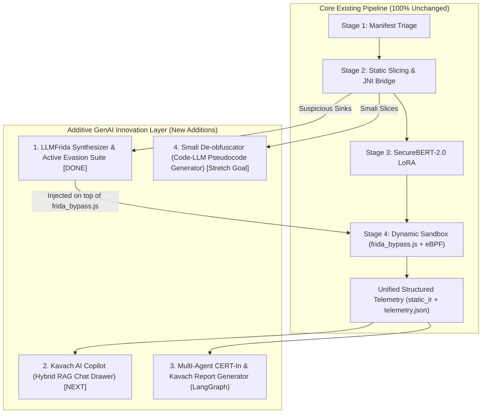

# Implementation & Submission Plan: August 15 – 17, 2026

## Objective
Implement, verify, and package all flagship Generative AI features and compile the prototype paper before the final submission deadline on **August 17, 2026**. **All features are 100% additive—zero modifications to the core static extraction, SecureBERT classification, or `frida_bypass.js` foundation.**

---

## Architectural Overview: Purely Additive GenAI Layer

---

## Active & Upcoming Milestones

### Milestone 1: Hybrid GraphRAG Ingestion & Interactive Copilot Drawer [NEXT UP]
* **Objective:** Conversational chatbot allowing auditors to query static and dynamic findings.
* **Core Technology Stack:**
  - **Vector DB:** **`pgvector`** (integrated locally in PostgreSQL) or **ChromaDB** (for lightweight local vector file storage).
  - **Embeddings:** **`sentence-transformers/all-MiniLM-L6-v2`** (local model converting Smali chunks into 384-dimensional arrays).
  - **Graph DB:** **NetworkX (Python)** in-memory knowledge graph with Neo4j compatibility for query paths.
  - **eBPF Filter:** **SyscallAD framework** implementing an in-memory **Isolation Forest** or **Variational Autoencoder (VAE)** to filter normal OS background syscalls and isolate anomalous traces.
* **Tasks:**
  - [ ] **Backend RAG Layer (`kavach_ai/backend/pipeline/stage6_synthesis/rag_engine.py`):**
    - Index the current APK's static slices and dynamic execution logs into the vector/graph store.
    - Implement **Query Router**: Classifies queries into semantic code search vs. relationship/graph traversal.
    - Expose `POST /api/chat-rag` streaming endpoint.
  - [ ] **Frontend Copilot Drawer (`kavach_ai/frontend/src/components/chat-copilot-drawer.tsx`):**
    - Floating expandable chat drawer in the bottom right of the dashboard.
    - Supports real-time markdown streaming, code blocks, and suggested quick-prompt chips (e.g., *"Explain the C2 communication"*).

---

### Milestone 2: Multi-Agent CERT-In & Kavach Regulatory Synthesis
* **Objective:** A LangGraph workflow that resolves track contradictions and generates Annexure A compliance forms.
* **Core Technology Stack:**
  - **Agent Framework:** **LangGraph** (managing cyclical states) or **custom lightweight asyncio state router**.
  - **LLM Agent Routing:** **Groq API** (`llama-3.3-70b-versatile` for synthesis, `llama-3.1-8b-instruct` for formatting/writing).
* **Tasks:**
  - [ ] **Multi-Agent Orchestrator (`kavach_ai/backend/pipeline/stage6_synthesis/multi_agent.py`):**
    - Implement 4 independent agents:
      1. **Static Auditor Agent:** Reviews permissions, static slices, and Attention LRP relevance markers.
      2. **Dynamic Sandbox Agent:** Parses Frida logs, eBPF syscalls, and modified files.
      3. **Synthesis Agent:** Cross-references static claims against dynamic observations (differentiates active exploits vs. dormant capabilities).
      4. **Compliance Writer Agent:** Formats verified threat data into the official **CERT-In Annexure A** template.
  - [ ] **Report UI & Export (`kavach_ai/frontend/src/components/views/cert-in-view.tsx`):**
    - Render interactive side-by-side preview with 1-click Markdown / PDF download.

---

### Milestone 3: Smali De-obfuscator & Pseudocode Generator (Stretch Goal)
* **Objective:** Translate unreadable Dalvik/Smali control-flow slices into high-level Python/Java pseudocode.
* **Core Technology Stack:**
  - **Inference Engine:** **Groq Cloud API** (`qwen2.5-coder-32b-instruct` or `llama-3.3-70b-versatile` with `temperature=0.1`).
  - **Context Splitting:** **AST-based chunker** written in Python (using method declarations `.method` to `.end method` as boundaries).
* **Tasks:**
  - [ ] **Backend Endpoint (`kavach_ai/backend/pipeline/stage6_synthesis/deobfuscator.py`):**
    - Accepts a raw Smali bytecode slice + dangerous sink signature.
    - Applies prompt formatting with PEFT/LoRA style task directives.
    - Exposes `POST /api/decompile-slice`.
  - [ ] **Frontend UI Integration (`kavach_ai/frontend/src/components/views/bert-classifier-view.tsx`):**
    - Add **"AI Decompile & Explain"** toggle button next to raw Smali slices.
    - Stream and display reconstructed pseudocode with syntax highlighting.

---

### Milestone 4: Prototype Paper Compilation & Submission Readiness (Deadline Day)
- [ ] **LaTeX Compilation (`docs/kavach_prototype_paper.tex`):**
  - Compile the `kavach_prototype_paper.tex` file using a local LaTeX compiler to generate the final IEEE submission PDF.
  - Double-check abstract, figures, diagrams, and formatting metrics.
- [ ] **Full Regression Testing:**
  - Execute a full end-to-end triage-to-report sweep with a sample APK to ensure no exceptions or async database race conditions occur.
- [ ] **Code Clean-up:**
  - Remove redundant debug/scratch files from the repository.
- [ ] **Zip Package Generation:**
  - Compress the final codebase, database models, static weights, and documentation folder according to BOI Hackathon submission constraints.

---

## Completed Milestones & Features

### [COMPLETED] Feature 1: Explainability Migration (SHAP to Attention LRP)
* **Objective:** Completely replace computationally heavy SHAP calculations with real-time model-specific Attention LRP relevance scores across the codebase.
* **Delivered Tasks:**
  - [x] **Backend Realignment (`kavach_ai/backend/pipeline/stage3_ml/lrp_validation.py`):**
    - Implemented Attention LRP relevance propagation ($\bar{A} = I + (\nabla A \odot A)^+$) for instant token attributions without perturbation loops.
  - [x] **Database Schema Refactoring (`kavach_ai/backend/app/db/models.py`):**
    - Refactored database models and attributions for direct Layerwise Relevance Propagation.
  - [x] **Frontend Visual Integration (`kavach_ai/frontend/src/components/views/bert-classifier-view.tsx`):**
    - Visualized Attention LRP token relevance heatmaps directly over decompiled Smali slices with confidence scores.

---

### [COMPLETED] Feature 2: Static-to-Dynamic LLMFrida Synthesizer
* **Objective:** Automatically write custom Frida JS scripts on the fly targeting obfuscated malware methods.
* **Core Technology Stack:**
  - **Synthesizer Engine:** **Groq Cloud API** (`qwen2.5-coder-32b-instruct` / `temperature=0.1`).
  - **Grounding Mode:** Dynamic Dalvik memory inspection, object string converters, and hex dumping.
* **Delivered Tasks:**
  - [x] **Backend Hook Generator (`kavach_ai/backend/pipeline/stage4_dynamic/llm_frida_synthesizer.py`):**
    - Analyzes static sinks (e.g. custom decrypt methods, DexClassLoader, reflection callers) and generates targeted JavaScript hooks wrapped in safe `Java.perform()` and `try/catch` wrappers.
    - Includes deterministic fallback templates for reliable offline operation.
  - [x] **Detonation Runner Integration (`kavach_ai/backend/pipeline/stage4_dynamic/detonate.py`):**
    - Dynamically merges the generated AI scripts directly with [`frida_bypass.js`](file:///c:/Users/Admin/Documents/Projects/Kavach/kavach_ai/backend/pipeline/stage4_dynamic/scripts/frida_bypass.js) into a temporary unified script before sandbox launch.
  - [x] **FastAPI Preview Endpoint (`kavach_ai/backend/app/main.py`):**
    - Added `POST /api/llm-frida/preview` endpoint for real-time frontend script generation and analysis.
  - [x] **Frontend UI Sandbox Card (`kavach_ai/frontend/src/components/upload-panel.tsx`):**
    - Previews the synthesized hook code in an expandable code drawer. Allows toggling LLMFrida, Chronos Time Dilution, and Apex Fuzzing before sandbox detonation.

---

### [COMPLETED] Feature 3: Active Evasion Bypassing (Combined Intent Fuzzing & Chronos Time Dilution)
* **Objective:** Combine passive sleep defusal (Frida clock acceleration) and active stimulus (ADB Intent/IPC Fuzzing) to guarantee evasive banking trojans detonate within the 20-second dynamic sandbox window.
* **Core Technology Stack:**
  - **Fuzzing Controller:** Python-based ADB orchestrator parsing exported activities, services, and receivers from Stage 1 manifest telemetry.
  - **Evasion Hook:** Frida-based Chronos time dilution engine (`frida_bypass.js` modifying `Thread.sleep` and `SystemClock.sleep`).
* **Delivered Tasks:**
  - [x] **Chronos Time Dilution Engine (`kavach_ai/backend/pipeline/stage4_dynamic/scripts/frida_bypass.js`):**
    - Intercepts `java.lang.Thread.sleep()` and `android.os.SystemClock.sleep()`, compressing delays $>50\text{ ms}$ down to $10\text{ ms} - 15\text{ ms}$.
  - [x] **Apex Intent Fuzzer (`kavach_ai/backend/pipeline/stage4_dynamic/fuzzer.py`):**
    - Reads manifest targets and dispatches fuzzed shell broadcasts (`am broadcast` with `FLAG_INCLUDE_STOPPED_PACKAGES: 0x00000020`, `am startservice`).
  - [x] **Execution Hook Synchronization (`kavach_ai/backend/pipeline/stage4_dynamic/detonate.py` & `__init__.py`):**
    - Synchronizes fuzzer triggering halfway through the observation window and captures `[LLM-Frida-Hook]` decrypted strings and `[Time-Dilution]` events into dynamic telemetry.
  - [x] **Frontend Terminal & Scorecard Updates (`terminal-console.tsx`, `report-view.tsx`, `kavach-scorecard.tsx`):**
    - Live terminal displays color-coded badges (`LLM-FRIDA`, `TIME-DILUTION`, `APEX-FUZZER`).
    - Added dedicated "Evasion Defusal & AI Hooks" evidence tab with 4-way evasion matrix (Time Dilution, Apex Fuzzing, Anti-Root Guard, SSL Pinning) and decrypted memory viewer. Zero emojis, pure Obsidian cyber aesthetic.
  - [x] **Automated Test Suite (`kavach_ai/backend/tests/test_llm_frida_and_evasion.py`):**
    - 5/5 automated unit and integration tests passing (`pytest` verified).

---

## Safety & System Constraints

1. **100% Additive Design:** All new GenAI modules hook into data outputs; the underlying extraction, slicing, and classification remain untouched.
2. **Zero Laptop Hardware Bottlenecks:** All heavy LLM inference routes through Groq Cloud API (`temperature=0.1`), keeping the laptop completely free and responsive for the Android emulator and frontend UI.
3. **Graceful Fallback:** If the Groq API key is missing or offline, the core pipeline still completes and displays static and dynamic results normally.
