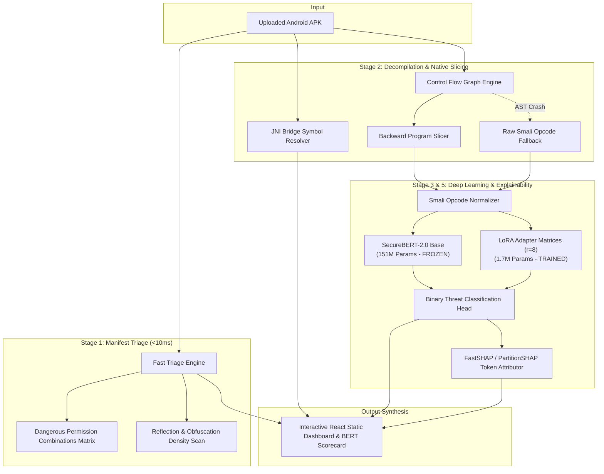
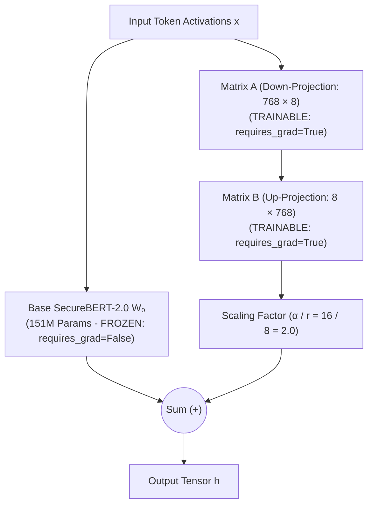

# Kavach.ai: Static Analysis & SecureBERT-2.0 LoRA Walkthrough

This document provides a comprehensive technical walkthrough of the **Static Analysis and Deep Learning Inference Pipelines (Stages 1, 2, 3 & 5)** within Kavach.ai. It covers the architectural data flow, technology stack, backward program slicing, JNI bridge resolution, SecureBERT-2.0 model architecture with LoRA (Low-Rank Adaptation), SHAP feature explainability, and frontend visualization.

---

## 1. Architectural Architecture & Data Flow

The static analysis pipeline operates as a deterministic, sub-second screening and semantic intelligence engine. When an APK is uploaded, it passes through sequential static extraction and neural classification stages before dynamic detonation.

```mermaid
sequenceDiagram
    participant Frontend as React SPA (Vite)
    participant Backend as FastAPI Server
    participant Triage as Stage 1: Manifest Triage Filter
    participant Decompiler as Stage 2A: Decompiler & Slicer
    participant JNI as Stage 2B: JNI Bridge Parser
    participant BERT as Stage 3: SecureBERT-2.0 LoRA
    participant SHAP as Stage 5: Explainability Engine

    Frontend->>Backend: POST /api/analyze-static (Upload APK)
    Backend->>Triage: fast_triage_apk(apk_bytes)
    
    rect rgb(20, 25, 35)
        Note over Triage: 10-Millisecond Triage Filter
        Triage->>Triage: Parse AndroidManifest.xml (Permissions & Components)
        Triage->>Triage: Evaluate Dangerous Permission Combinations
        Triage->>Triage: Compute Reflection & Obfuscation Density Score
    end
    
    Triage-->>Backend: TriageResult (Verdict, Score, Heuristics)
    Backend->>Frontend: Stream Stage 1 Triage Scorecard SSE

    rect rgb(25, 20, 30)
        Note over Decompiler, JNI: Static Slicing & JNI Bridge Mapping
        Backend->>Decompiler: extract_and_slice(apk_path)
        Decompiler->>Decompiler: Construct Control Flow Graph (CFG)
        Decompiler->>Decompiler: Backward Program Slicing from Dangerous Sinks
        Decompiler->>Decompiler: Fallback to Raw Smali if AST Decompile Fails
        Backend->>JNI: analyze_jni_bridges(extracted_libraries)
        JNI->>JNI: Resolve Native Symbols (llvm-nm / readelf / python_elf)
        JNI->>JNI: Map Short/Long Mangled Names (Java_pkg_class_method)
    end

    Decompiler-->>Backend: Extracted Smali Slices
    JNI-->>Backend: JniAnalysisResult (Mapped Exports, Dynamic Registrations)

    rect rgb(20, 30, 25)
        Note over BERT, SHAP: SecureBERT-2.0 LoRA Inference & Explainability
        Backend->>BERT: predict_slices(smali_slices)
        BERT->>BERT: Normalize Registers & Smali Opcodes
        BERT->>BERT: Forward Pass (151M Base Frozen + 1.7M LoRA Adapters)
        BERT-->>Backend: Slice Threat Probabilities (0.0 to 1.0)
        
        Backend->>SHAP: explain_slice_attributions(top_slices)
        SHAP->>SHAP: Compute PartitionSHAP / FastSHAP Token Weights
        SHAP-->>Backend: Token Attribution Matrices & Glow Heatmaps
    end

    Backend->>Frontend: Stream Result SSE (Static IR, Predictions, SHAP Weights)
    Frontend->>Frontend: Render StaticView & BertClassifierView Dashboard
```

### 1.1. Static Analysis Subsystem Architecture

The pipeline divides cognitive responsibilities into specialized, bounded modules:

---

## 2. Technology Stack

The static analysis pipeline integrates high-performance reverse engineering utilities with transformer-based deep learning:

*   **Androguard & pyaxmlparser**: High-speed binary XML and manifest parsing, extracting package metadata, declared permissions, exported components, and intent filters in under 10ms.
*   **Dalvik & Smali Bytecode Slicing Engine**: Custom AST and Control Flow Graph (CFG) engine that performs backward dependency slicing from dangerous API sinks (SMS, Telephony, Accessibility, Process Execution).
*   **ELF Binary Parsers (`llvm-nm`, `nm`, `readelf`, `python_elf`)**: Multi-backend native symbol extractor resolving C/C++ exported functions in `.so` files to detect native JNI execution channels.
*   **PyTorch & Hugging Face Transformers**: Local execution engine for SecureBERT-2.0 transformer inference without external cloud dependencies.
*   **Hugging Face PEFT (Parameter-Efficient Fine-Tuning)**: Implements Low-Rank Adaptation (LoRA), keeping base transformer weights frozen while routing forward passes through lightweight adapter matrices ($r=8$).
*   **SHAP (SHapley Additive exPlanations)**: Sub-second token-level game-theoretic feature attribution mapping malicious versus benign tokens in Smali code.
*   **FastAPI & React/TypeScript (Vite)**: Asynchronous REST and Server-Sent Event (SSE) backend streaming static results to interactive scorecard components.

---

## 3. Detailed Script Analysis

The core static analysis pipeline scripts reside under:
* `kavach_ai/backend/pipeline/stage1_triage`
* `kavach_ai/backend/pipeline/stage2_static`
* `kavach_ai/backend/pipeline/stage3_ml`

### 3.1. Stage 1: Manifest Triage (`stage1_triage/triage.py`)
*   **File Link**: [triage.py](file:///c:/Users/Admin/Documents/Projects/Kavach/kavach_ai/backend/pipeline/stage1_triage/triage.py)
*   **Primary Responsibility**: Instant preliminary screening of APK metadata and permissions before executing compute-heavy decompilation.
*   **Core Mechanics**:
    1.  **10-Millisecond Triage Filter**: Unzips `AndroidManifest.xml` in memory without writing full uncompressed APK contents to disk.
    2.  **Permission Combination Heuristics**: Evaluates high-risk co-occurrences rather than isolated permissions:
        *   `BIND_ACCESSIBILITY_SERVICE` + `RECEIVE_SMS` + `SYSTEM_ALERT_WINDOW` $\rightarrow$ **Banking Trojan Indicator**.
        *   `REQUEST_INSTALL_PACKAGES` + `RECEIVE_BOOT_COMPLETED` $\rightarrow$ **Stealth Dropper Indicator**.
        *   `RECORD_AUDIO` + `CAMERA` + `READ_CONTACTS` + `ACCESS_FINE_LOCATION` $\rightarrow$ **Spyware Indicator**.
    3.  **Reflection & Obfuscation Density Scan**: Detects high concentrations of Java reflection APIs (`Class.forName`, `getMethod`, `method.invoke`) and high-entropy base64/hex strings, flagging APKs that intentionally obscure static signatures.

### 3.2. Stage 2A: Decompilation & Static Slicing (`stage2_static/decompile.py` & `stage3_ml/slicing.py`)
*   **File Links**: [decompile.py](file:///c:/Users/Admin/Documents/Projects/Kavach/kavach_ai/backend/pipeline/stage2_static/decompile.py), [slicing.py](file:///c:/Users/Admin/Documents/Projects/Kavach/kavach_ai/backend/pipeline/stage3_ml/slicing.py)
*   **Primary Responsibility**: Extracts executable bytecode, builds Control Flow Graphs (CFGs), and backward-slices code from high-risk API sinks.
*   **Core Mechanics**:
    1.  **Dangerous Sink Identification**: Identifies entry sinks matching sensitive Android APIs:
        *   `Landroid/telephony/SmsManager;->sendTextMessage` (SMS fraud / exfiltration)
        *   `Ljava/lang/Runtime;->exec` (Command injection)
        *   `Landroid/location/LocationManager;->getLastKnownLocation` (Surveillance)
        *   `Ldalvik/system/DexClassLoader;->loadClass` (Dynamic payload loading)
    2.  **Backward Program Slicing**: Traverses data-flow and control-flow dependencies backward from the sink up to $N$ hops (configurable depth), extracting only the instructions that directly influence arguments passed into dangerous calls.
    3.  **Smali Fallback Engine**: If full Java decompilation fails due to malformed ZIP headers, anti-decompilation tricks, or obfuscated CFGs, Kavach automatically falls back to raw Smali opcodes (`invoke-virtual`, `const-string`, `check-cast`), ensuring zero dropped samples.

### 3.3. Stage 2B: JNI & Native Library Bridge (`stage2_static/jni_bridge.py`)
*   **File Link**: [jni_bridge.py](file:///c:/Users/Admin/Documents/Projects/Kavach/kavach_ai/backend/pipeline/stage2_static/jni_bridge.py)
*   **Primary Responsibility**: Bounded, deterministic static analysis of native C/C++ shared libraries (`.so`) packaged inside the APK.
*   **Core Mechanics**:
    1.  **Mangled Symbol Resolution**:
        *   *Short Name*: `Java_com_example_app_MainActivity_nativeMethod`
        *   *Long Name (Overloaded)*: `Java_com_example_app_MainActivity_nativeMethod__I`
    2.  **Multi-Backend Symbol Extraction**: Leverages `llvm-nm`, `nm`, `readelf`, or custom `python_elf` parsers to extract symbol tables from ELF headers.
    3.  **Dynamic Registration Detection**: Scans `.rodata` and string tables for references to `RegisterNatives` or `JNI_OnLoad`, identifying apps that register native method addresses at runtime to evade static symbol matching.

### 3.4. Stage 3: Machine Learning Inference (`stage3_ml/inference.py`, `normalization.py`, `extractor.py`)
*   **File Links**: [inference.py](file:///c:/Users/Admin/Documents/Projects/Kavach/kavach_ai/backend/pipeline/stage3_ml/inference.py), [normalization.py](file:///c:/Users/Admin/Documents/Projects/Kavach/kavach_ai/backend/pipeline/stage3_ml/normalization.py), [extractor.py](file:///c:/Users/Admin/Documents/Projects/Kavach/kavach_ai/backend/pipeline/stage3_ml/extractor.py)
*   **Primary Responsibility**: Tokenizes normalized Smali slices, performs sub-second forward passes through the fine-tuned SecureBERT-2.0 transformer, and outputs calibrated threat probabilities.
*   **Core Mechanics**:
    1.  **Register & Opcode Normalization**: Maps arbitrary register names (`v0`, `v1`, `p0`) to standardized register tokens (`REG_VAR`, `REG_PARAM`) to prevent model overfitting on arbitrary compiler register assignments.
    2.  **Model Loading**: Loads base SecureBERT-2.0 architecture and applies fine-tuned LoRA adapter tensors from `weights/`.
    3.  **Rule-Based Fallback Classifier**: If GPU/PyTorch execution is unavailable, seamlessly activates a heuristic fallback engine matching opcode n-grams to maintain uninterrupted pipeline operation.

---

## 4. SecureBERT-2.0 & LoRA Architecture

Kavach.ai uses a customized transformer architecture specifically adapted for cybersecurity Smali analysis via **Low-Rank Adaptation (LoRA)**.

### 4.1. Mathematical Formulation of LoRA

In standard transformer fine-tuning, all parameters in weight matrix $W_0 \in \mathbb{R}^{d \times k}$ are updated ($W = W_0 + \Delta W$).

With LoRA, the base matrix $W_0$ is **100% frozen** (`requires_grad = False`). The weight update $\Delta W$ is decomposed into two low-rank matrices:

$$\Delta W = B \cdot A$$

where:
* $A \in \mathbb{R}^{r \times d}$ is the down-projection matrix (initialized with Gaussian distribution $\mathcal{N}(0, \sigma^2)$).
* $B \in \mathbb{R}^{k \times r}$ is the up-projection matrix (initialized to $0$).
* $r \ll \min(d, k)$ is the rank bottleneck ($r = 8$).

Forward propagation computes:

$$h = W_0 x + \frac{\alpha}{r} (B \cdot A) x$$

This modifies the effective model outputs identically to full fine-tuning, while reducing trainable parameters by **over 98.8%** and keeping adapter checkpoints under **7 MB**.

---

### 4.2. Training Configurations & Hyperparameter Matrix

The model was trained across multiple configurations specified in [`training/configs/`](file:///c:/Users/Admin/Documents/Projects/Kavach/training/configs):

| Hyperparameter | `smoke.yaml` (Testing) | `train_balanced_1to1.yaml` | `train_full_weighted.yaml` (Production) |
| :--- | :--- | :--- | :--- |
| **Base Model** | `ehsanaghaei/SecureBERT` | `ehsanaghaei/SecureBERT` | `ehsanaghaei/SecureBERT` |
| **Base Parameters** | 151,000,000 (Frozen) | 151,000,000 (Frozen) | 151,000,000 (Frozen) |
| **LoRA Rank ($r$)** | 8 | 8 | 8 |
| **LoRA Alpha ($\alpha$)** | 16 | 16 | 16 |
| **LoRA Dropout** | 0.05 | 0.05 | 0.05 |
| **Target Modules** | `query`, `value`, `key`, `dense` | `query`, `value`, `key`, `dense` | `query`, `value`, `key`, `dense` |
| **Trainable Params** | 1,771,778 (1.16%) | 1,771,778 (1.16%) | 1,771,778 (1.16%) |
| **Adapter File Size** | ~6.8 MB | ~6.8 MB | ~6.8 MB |
| **Learning Rate** | $2.0 \times 10^{-4}$ | $2.0 \times 10^{-4}$ | $2.0 \times 10^{-4}$ |
| **LR Scheduler** | Cosine with Warmup | Cosine with Warmup | Cosine with Warmup |
| **Warmup Ratio** | 0.06 | 0.06 | 0.06 |
| **Max Sequence Length** | 512 tokens | 512 tokens | 512 tokens |
| **Batch Size (Per Device)**| 4 | 8 | 8 |
| **Gradient Accumulation** | 2 | 4 | 4 |
| **Positive Class Weight** | 1.0 | 1.0 | **3.5** (Penalizes false negatives) |
| **Precision** | FP16 / BF16 | FP16 / BF16 | FP16 / BF16 |
| **Training Epochs** | 1 | 5 | 8 |

---

## 5. Explainability Engine: SHAP Token Attribution

To provide complete transparency to cybersecurity analysts, Kavach does not treat SecureBERT-2.0 as a black box. Stage 5 computes token-level Shapley attribution values for every classified Smali slice:

1. **FastSHAP / PartitionSHAP Algorithm**: Evaluates the marginal contribution of each Smali opcode, register, and API call to the final malicious probability score.
2. **Attribution Sign Mapping**:
   * **Positive SHAP (+)**: Red highlights indicate tokens that strongly drove the classification toward **MALICIOUS** (e.g., `sendTextMessage`, `DexClassLoader`, `getDeviceId`, `chmod 777`).
   * **Negative SHAP (-)**: Blue highlights indicate tokens characteristic of standard benign programming logic (e.g., standard UI callbacks, logging, string builders).
3. **Interactive Highlighting**: Rendered in the frontend using HSL-based colored glows, allowing analysts to inspect the exact lines of code that triggered the alert in sub-second time.

---

## 6. Frontend Telemetry Analysis & Consumption

The static analysis pipeline streams data into specialized interactive React components:

### 6.1. UI Components Breakdown
*   **Static View ([`static-view.tsx`](file:///c:/Users/Admin/Documents/Projects/Kavach/kavach_ai/frontend/src/components/static-view.tsx))**: Displays declared vs. used permissions, dangerous permission combination badges, reflection density gauges, and mapped native `.so` libraries.
*   **BERT Classifier View ([`bert-classifier-view.tsx`](file:///c:/Users/Admin/Documents/Projects/Kavach/kavach_ai/frontend/src/components/views/bert-classifier-view.tsx))**: Renders extracted Smali slices, model confidence scores, and interactive SHAP token heatmaps.
*   **Kavach Scorecard ([`kavach-scorecard.tsx`](file:///c:/Users/Admin/Documents/Projects/Kavach/kavach_ai/frontend/src/components/kavach-scorecard.tsx))**: Synthesizes static triage with ML scores to calculate the unified risk index.

---

## 7. MITRE ATT&CK & CERT-In Static Compliance Mapping

Static signals map directly into standard cybersecurity threat taxonomies:

| Static Indicator | MITRE ATT&CK Mobile Technique | CERT-In Security Mandate |
| :--- | :---: | :---: |
| `BIND_ACCESSIBILITY_SERVICE` + `SYSTEM_ALERT_WINDOW` | **T1417 / T1624** (Input Injection / Overlay) | **Sec 12.2** (Anti-Tampering & Accessibility Binds) |
| `SmsManager;->sendTextMessage` Slices | **T1582 / T1636** (SMS Exfiltration / Fraud) | **Sec 14.2** (Sensitive Data Transmission) |
| `DexClassLoader` Dynamic Loading | **T1407** (Download New Code at Runtime) | **Sec 8.4** (Integrity Verification of Code) |
| `Runtime;->exec` Shell Execution | **T1547** (Execution via System Command) | **Sec 12.1** (Process Privilege Boundaries) |
| Mangled JNI Native Execution (`.so`) | **T1629** (Execution through Native Code) | **Sec 10.3** (Binary Code Integrity Audit) |
