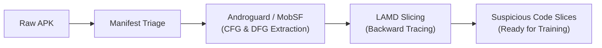
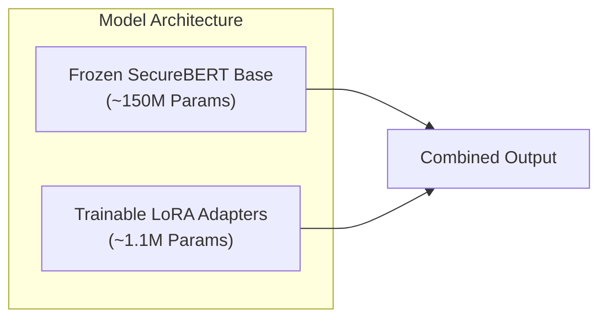
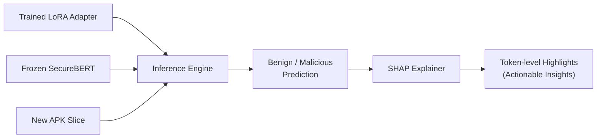

# SecureBERT-2.0 LoRA Fine-Tuning Specification

Welcome to the training stage of the Kavach.ai pipeline! If you're new to this part of the project, this document will get you up to speed on how we train our machine learning model to detect malicious Android applications. 

We keep things as simple as possible while maintaining a rigorous, reproducible pipeline.

---

## 1. Prerequisites / Context

Before data even reaches this training stage, it goes through a heavy static analysis pipeline to extract the most important pieces of code from the raw Android APKs. You don't need to know all the exact implementation details to run the training, but here is the high-level journey of an app:

1. **Manifest Triage**: First, we parse the `AndroidManifest.xml`. We aren't just looking for junk; we actively extract requested permissions (like `READ_CONTACTS` or `SEND_SMS`), exported components (Activities, Services, Receivers), and intents. This gives us an initial risk profile and identifies the entry points of the application.
2. **Deep Static Analysis (Androguard & MobSF)**: We use **Androguard** to decompile the bytecode (Dalvik/Smali) into an intermediate representation. From this, we build **Control Flow Graphs (CFGs)** — maps of how the program branches and executes — and **Data Flow Graphs (DFGs)** — maps of how variables and data move through the app. We supplement this with **MobSF**, which runs broader static checks for known vulnerabilities, hardcoded secrets, and suspicious API usage.
3. **Backward Program Slicing (LAMD Method)**: This is the core magic before training. Using a method inspired by the LAMD paper, we identify known "dangerous" API calls (the "sinks" — e.g., sending an SMS, opening a network socket). Instead of analyzing the whole app, we use the CFGs and DFGs to **trace backwards** from those dangerous calls to see where the data originated (the "sources"). 

**Why do this?** 
An average APK has thousands of lines of code, much of which is just UI rendering, ad libraries, or standard Android boilerplate. Feeding all that noise into a language model dilutes the signal and blows up the memory budget. By extracting only the highly concentrated "slices" of code that form the execution path to a sensitive action, we give SecureBERT exactly what it needs to learn the *intent* behind the code.

---

## 2. Dataset

We train our model on data derived from datasets like **CIC-MalDroid 2020**, combined with our own curated benign and malicious samples.

- **Classes**: Two classes — `Benign` (0) and `Malicious` (1).
- **Scale**: We process thousands of APKs, which translates to tens of thousands of code slices. For example, our full training set contains around 58,970 eligible training slices.
- **Balancing**: Because benign apps often have more code slices than malicious ones, our pipeline supports **balanced sampling** (pairing 1 malicious slice to 1 benign slice per epoch) or **weighted loss** (using all data but penalizing the model more for getting the minority class wrong).
- **Splits**: We maintain strict Train, Validation, and Test splits. Importantly, we ensure there is no "data leakage" — slices from the same APK will *never* be split across Train and Validation sets. If an app is in the training set, all of its slices are in the training set.

---

## 3. Model & Training Configuration

We use **SecureBERT-2.0** as our base model. SecureBERT is a language model (similar to the technology behind ChatGPT, but much smaller) specifically pre-trained on cybersecurity text and code.

To train it efficiently on consumer hardware, we use a technique called **LoRA (Low-Rank Adaptation)**. Instead of updating all 150+ million parameters of the model (which requires massive GPUs), LoRA freezes the main model and only trains a tiny set of "adapter" weights injected into specific layers.

### Hardware Constraints
- **VRAM Budget**: We designed this pipeline to run comfortably within an **8GB VRAM** constraint (e.g., standard consumer GPUs or Apple Silicon MPS). 

### Hyperparameters
- **Base Model**: `SecureBERT-2.0-base` (ModernBert architecture).
- **LoRA Rank ($r$)**: 8 (controls the size and expressiveness of the adapter).
- **LoRA Alpha**: 16 (scaling factor for the adapter updates).
- **LoRA Dropout**: 0.05 (helps prevent the model from overfitting to the training data).
- **Target Modules**: `Wqkv` (we only inject our LoRA adapters into the attention mechanisms of the 22 transformer blocks).
- **Trainable Parameters**: Only about ~0.75% of the model is actually trained! (Around 1.1 million parameters).

### Training Setup
- **Batch Size**: We use small physical batch sizes (e.g., 2 or 4) combined with **Gradient Accumulation** (e.g., 8 steps) to simulate a larger effective batch size (like 16) without blowing up the VRAM.
- **Optimizer & Learning Rate**: We typically use a learning rate around `2e-4` with a warmup period.
- **Sequence Length**: Max context length is capped (e.g., 512 or 1024 tokens) so it fits in memory.

---

## 4. Training Files & Scripts

The training code is highly modularized inside the `training/` directory. Here is where everything lives and what it does:

- **`training/configs/*.yaml`**: Configuration files that define different training runs (e.g., `smoke.yaml` for a quick 3-second test, `train_balanced_1to1.yaml` for a serious run).
- **`training/train.py`**: The main entry point. You run this script and point it to a config file to start training.
- **`training/pipeline/config.py`**: Reads the YAML files, validates them, and sets up strict configuration rules.
- **`training/pipeline/data.py`**: Handles loading the JSON datasets, tokenizing the code slices, and safely batching them up.
- **`training/pipeline/model.py`**: Loads the base SecureBERT model, freezes it, and attaches our trainable LoRA adapters.
- **`training/pipeline/trainer.py`**: Our custom wrapper around the Hugging Face Trainer. It handles the actual training loop, calculating the balanced loss, and evaluating the model.
- **`training/pipeline/metrics.py` & `provenance.py`**: Tracks our metrics (F1 score, Precision, Recall) and logs exactly what hardware and settings were used so every run is 100% reproducible.

---

## 5. Weights & Biases (W&B) Integration

We use **Weights & Biases (W&B)** to track our experiments. Think of it as a shared, cloud-based dashboard for machine learning. 

### What gets logged?
- **Live Loss Curves**: Watch the training and validation loss go down in real-time as the model learns.
- **Metrics**: Precision, Recall, and F1 scores are calculated and graphed automatically over time.
- **Hyperparameters**: Every setting from the YAML config is saved alongside the run. We never have to guess exactly how a specific model was trained.
- **System Stats**: Tracks GPU usage, VRAM consumption, and temperature to ensure we aren't bottlenecking.

### Collaboration
Because W&B is cloud-based, when you run a training script on your laptop, the dashboard updates live for the whole team. We can easily compare your run against my run, overlay the graphs, and figure out which hyperparameters worked best without having to send files back and forth.

---

## 6. Local Setup Check

Before you kick off a training run, make sure your environment is ready:

1. **Python Environment**: Ensure you are in the project's virtual environment (e.g., `.venv` activated). 
2. **Dependencies**: Make sure you have installed the requirements (PyTorch, Transformers, PEFT, etc.).
3. **Weights & Biases Login**:
   - You need a free W&B account.
   - Run `wandb login` in your terminal and paste your API key when prompted.
   - Make sure your team project name is correctly set in the YAML configs (e.g., `project: kavach-securebert`).
4. **Data**: Ensure the preprocessed slices (`training/data/`) and the base model weights (`training/models/SecureBERT2.0-base`) are downloaded locally.

*(Tip: Run `python training/train.py --config training/configs/smoke.yaml` first. This is a 3-second test run that proves your hardware, data, and environment are working perfectly before you commit to a multi-hour serious run).*

---

## 7. Output & Evaluation

### What does the model output?
Once training finishes, the output isn't a massive 500MB model file. Because we used LoRA, the output is just a tiny folder containing the **adapter weights** (only a few megabytes). 

To use the trained model in production, our pipeline loads the frozen SecureBERT base model, and then hot-swaps your tiny adapter weights on top of it.

### How is it evaluated?
During and after training, the model is evaluated on the held-out Validation set. We care most about:
- **Recall**: Are we catching the malicious slices? (Minimizing False Negatives).
- **F1 Score**: The harmonic balance between Precision and Recall.
- We track the exact confusion matrix (True Positives, False Positives, True Negatives, False Negatives).

### Next Steps: SHAP Attribution
Once we have a trained model that accurately classifies slices as Benign or Malicious, it feeds into the final stage of Kavach.ai: **Explainability**.

We use **SHAP (SHapley Additive exPlanations)** to look at a slice the model flagged as malicious, and highlight the exact lines of code (tokens) that caused the model to make that decision. This turns our AI from a "black box" into an actionable, transparent tool for security analysts.

